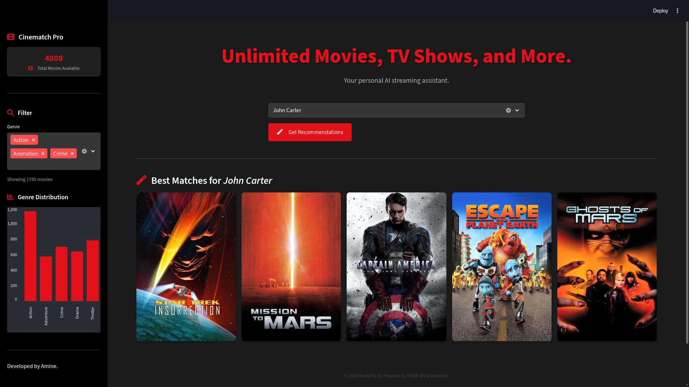

# 🎬 Cinematch – Movie Recommendation System

Cinematch is a **content-based movie recommendation system** built with Machine Learning and deployed using **Streamlit**.  
It recommends movies similar to a selected title using movie metadata and **cosine similarity**.

This project showcases the full ML pipeline, from data preprocessing to deployment with a **Netflix-inspired user interface**.

---

## 🚀 Demo

🔗 **Live App:** Coming soon  
📸 **Preview:

<div align="center">
  
</div>

---

## ✨ Key Features

- 🎯 Content-based movie recommendation
- 🔝 Returns **Top 5 most similar movies**
- 🧠 Precomputed cosine similarity matrix
- 🎥 Movie posters & metadata via **TMDB API**
- 🎛️ Genre filtering & trending movies
- 🖥️ Netflix-style premium UI (Streamlit)
- ⚡ Optimized with caching for fast performance

---

## 🛠️ Tech Stack

- **Language:** Python  
- **Machine Learning:** pandas, numpy, scikit-learn  
- **Web Framework:** Streamlit  
- **API:** TMDB API  
- **Other Tools:** pickle, Git, GitHub  

---

## 🧩 Project Structure

```text
movie-recommendation-system/
│
├── app.py
├── recommender.py
├── artifacts/
│   ├── new_df.pkl
│   └── similarity.pkl
├── data_project/
│   ├── movies.csv
│   └── credits.csv
├── notebooks/
│   └── programm.ipynb
├── __pycache__/
└── README.md
```

---

## 📂 Dataset

The project uses rich **movie metadata**, including:

- 🎬 **Movie title**
- 🎭 **Genres**
- 📝 **Overview** (description)
- 🔥 **Popularity score**
- ⭐ **Vote average**
- 📅 **Release date**

### 📌 Data Sources

- 📊 **Kaggle** – TMDB movie dataset  
- 🎥 **TMDB API** – Movie posters and additional metadata  

---

## ⚙️ Installation

### 📥 Clone the Repository

```bash
git clone https://github.com/YOUR_USERNAME/movie-recommendation-system.git
cd movie-recommendation-system
```

---

## ▶️ Usage

### 🚀 Run the Application

```bash
streamlit run app.py
```

---

## 🧭 How It Works

- 🔍 Select a movie from the search box  
- 🖱️ Click **Get Recommendations**  
- 🎯 Instantly receive the **Top 5 most similar movies**

---

## 🧠 Recommendation Logic

Cinematch uses a **content-based filtering** approach:

- 🧹 Movie metadata is **preprocessed and combined**
- 🔤 Text features are **vectorized**
- 📐 Similarity is computed using **Cosine Similarity**
- 💾 The similarity matrix is saved using **pickle**
- 🏆 The system retrieves the **Top 5 closest movies** for a given title

---

## 📈 Performance & Optimization

- ⚡ Fast inference using a **precomputed similarity matrix**
- 🧠 Cached data loading with `@st.cache_data`
- 📊 Efficient UI rendering and filtering with **Streamlit**

---

## 🔮 Future Improvements

- 🔄 Add **collaborative filtering**
- 🧬 Build a **hybrid recommendation system**
- 👤 User authentication & user profiles
- ⭐ Rating-based personalization
- ☁️ Cloud deployment  
  *(Streamlit Cloud / AWS / Hugging Face)*

---

## 👤 Author

**Amine El-baydaouy**  
🎓 Engineering Student | 🤖 AI & Data Science Enthusiast  

- 💻 GitHub: https://github.com/amineamine762  
- 🔗 LinkedIn: https://www.linkedin.com/in/amine-el-baydaouy/ 

